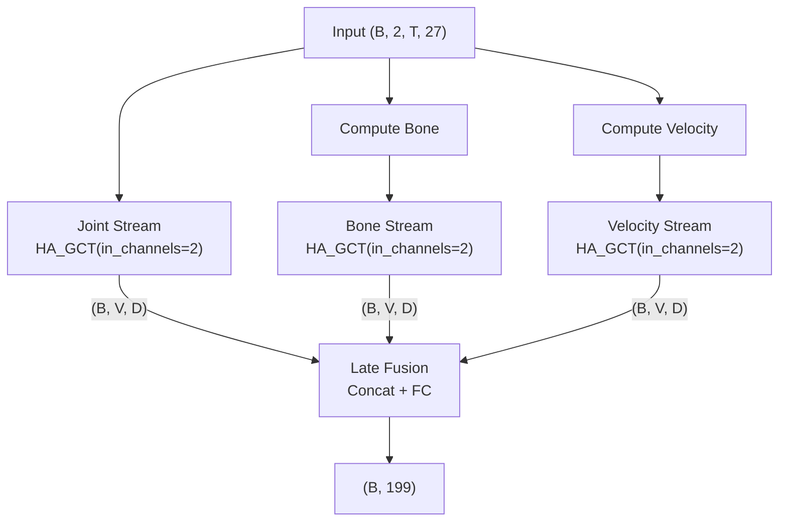

# 🎯 Chiến lược nâng cao Accuracy cho HA-GCT trên MultiVSL200

## Tình trạng hiện tại

| Metric | Seed 42 | Seed 43 | Mục tiêu |
|---|---|---|---|
| **Val Acc (Top-1)** | ~60% | **61.69%** | **~70%+** |
| **Test Acc (Top-1)** | 56.98% | **57.93%** | **~67%+** |
| **Test Acc (Top-5)** | 83.56% | 87.19% | ~92%+ |
| Val-Test Gap | ~3% | ~4% | < 2% |
| Train-Val Gap | ~17% | ~16% | < 10% |

### Dataset profile
- **5223 mẫu** / **199 classes** / **27 signers** → trung bình chỉ **~26 mẫu/class**
- Shape mỗi mẫu: `(150, 27, 3)` = 150 frames × 27 joints × 3 channels (x, y, confidence)
- Đây là dataset **cực kỳ nhỏ** cho 199 classes → **regularization + augmentation mạnh là chìa khóa**

### Chẩn đoán vấn đề chính

```
Train Acc ~78% vs Val Acc ~62% → GAP ~16% = OVERFITTING NGHIÊM TRỌNG
Val Acc ~62% vs Test Acc ~58% → GAP ~4% = Split không đồng đều hoặc data variance cao
```

> [!IMPORTANT]
> Vấn đề cốt lõi không phải model yếu (train acc đã 78%), mà là **overfitting trên dataset nhỏ**.
> Chiến lược phải tập trung vào: **(1) Tăng diversity dữ liệu**, **(2) Regularization mạnh hơn**, **(3) Ensemble thông minh hơn**.

---

## Chiến lược cải tiến (xếp theo mức độ tác động & dễ triển khai)

---

### 🟢 Chiến lược 1: Sửa Data Augmentation Pipeline (ĐÃ LÀM ✅)

**Mức độ tác động:** ⭐⭐⭐⭐ | **Độ khó:** Dễ | **Thời gian:** 5 phút

Bug đã sửa: `MultiVSL200Dataset.__init__` áp dụng augmentor tĩnh lên dữ liệu trước khi lưu RAM, dẫn đến:
- Dữ liệu bị biến dạng cố định + bị augment thêm lần 2 trong `__getitem__`
- Mất tính đa dạng epoch-to-epoch

**Kỳ vọng:** +2% ~ +5% accuracy nhờ dynamic augmentation thực sự

---

### 🟢 Chiến lược 2: CutMix/MixUp cải tiến + Temporal MixUp

**Mức độ tác động:** ⭐⭐⭐ | **Độ khó:** Dễ | **Thời gian:** 15 phút

Hiện tại MixUp đang trộn toàn bộ sample (`lam * x_a + (1-lam) * x_b`). Với skeleton data, điều này tạo ra các mẫu **phi vật lý** (hai bộ khớp trộn vào nhau).

**Đề xuất cải tiến:**
1. **Temporal CutMix**: Thay vì trộn toàn bộ, cắt ghép các đoạn thời gian từ 2 mẫu khác nhau:
   ```python
   # Chọn ngẫu nhiên điểm cắt
   cut_point = random.randint(T//4, 3*T//4)
   mixed_data[:, :, :cut_point, :] = x_a[:, :, :cut_point, :]
   mixed_data[:, :, cut_point:, :] = x_b[:, :, cut_point:, :]
   ```
   → Mẫu kết quả vẫn hợp lý về mặt vật lý (nửa đầu ký hiệu A + nửa sau ký hiệu B)

2. **Joint-level CutMix**: Giữ nguyên một nửa joints từ sample A, thay thế nửa còn lại từ sample B:
   ```python
   # Chia thành hand-left, hand-right, body
   mask_joints = random.sample(range(27), 13)
   mixed_data[:, :, :, mask_joints] = x_b[:, :, :, mask_joints]
   ```

**Kỳ vọng:** +1% ~ +3% accuracy

---

### 🟡 Chiến lược 3: Exponential Moving Average (EMA) của trọng số mô hình

**Mức độ tác động:** ⭐⭐⭐⭐ | **Độ khó:** Trung bình | **Thời gian:** 20 phút

EMA duy trì một bản sao "trung bình hóa" (smoothed) của trọng số mô hình trong suốt quá trình huấn luyện. Bản sao này thường cho kết quả tốt hơn bản gốc vì nó **lọc bỏ nhiễu gradient** và tìm được vùng loss phẳng hơn.

```python
class ModelEMA:
    def __init__(self, model, decay=0.999):
        self.ema_model = copy.deepcopy(model)
        self.decay = decay
        for p in self.ema_model.parameters():
            p.requires_grad_(False)

    @torch.no_grad()
    def update(self, model):
        for ema_p, model_p in zip(self.ema_model.parameters(), model.parameters()):
            ema_p.data.mul_(self.decay).add_(model_p.data, alpha=1 - self.decay)
```

Cách dùng:
- Sau mỗi optimizer step: `ema.update(model)`
- Khi eval: dùng `ema.ema_model` thay vì `model`
- Khi save best checkpoint: lưu cả `ema.ema_model.state_dict()`

> [!TIP]
> EMA đặc biệt hiệu quả với dataset nhỏ vì nó giảm variance của mô hình.
> Decay = 0.999 nghĩa là mỗi step chỉ update 0.1% trọng số mới → rất ổn định.

**Kỳ vọng:** +2% ~ +4% accuracy (gần như "miễn phí" vì không tốn thêm thời gian huấn luyện)

---

### 🟡 Chiến lược 4: True Multi-Stream (Joint + Bone + Velocity)

**Mức độ tác động:** ⭐⭐⭐⭐⭐ | **Độ khó:** Trung bình-Cao | **Thời gian:** 30-45 phút

Hiện tại `MultiStreamHA_GCT` chỉ là **Single Stream (Joint only)**. Đây là một cơ hội lớn.

**Thiết kế đề xuất:**



**Tại sao hiệu quả:**
- **Joint**: Vị trí tuyệt đối → nhận diện tư thế tĩnh
- **Bone**: Khoảng cách tương đối → cấu trúc bàn tay/cánh tay
- **Velocity**: Chuyển động → động thái ký hiệu (quan trọng nhất cho sign language)

3 loại đặc trưng này **bổ trợ** cho nhau, không thể thay thế.

> [!WARNING]
> True Multi-Stream sẽ **x3 số tham số** và **x3 thời gian huấn luyện**. Với GPU 24GB, có thể cần giảm d_model xuống 192 hoặc 128, hoặc giảm batch_size.

**Kỳ vọng:** +5% ~ +10% accuracy (đây là cải tiến lớn nhất có thể)

---

### 🟡 Chiến lược 5: Cải tiến Ensemble với mô hình đa dạng hơn

**Mức độ tác động:** ⭐⭐⭐⭐ | **Độ khó:** Trung bình | **Thời gian:** Phụ thuộc vào train time

Ensemble hiện tại chỉ khác nhau ở **random seed**, dẫn đến các mô hình rất tương tự nhau → lợi ích ensemble thấp.

**Đề xuất đa dạng hóa:**

| Model | Architecture | Input | Mô tả |
|---|---|---|---|
| Model 1 | MultiStream (joint only) | Joint (2ch) | Baseline hiện tại |
| Model 2 | EarlyFusion | Joint+Bone+Vel (6ch) | Đã có sẵn trong code |
| Model 3 | True MultiStream | Joint+Bone+Vel (3×2ch) | Cần xây mới |
| Model 4 | MultiStream + EMA | Joint (2ch) | EMA checkpoint |

**Fusion cuối cùng:**
```python
# Weighted probability averaging
prob_final = w1*prob_m1 + w2*prob_m2 + w3*prob_m3 + w4*prob_m4
# Tối ưu weights bằng validation set
```

> [!TIP]
> Chỉ cần ensemble 2-3 mô hình **khác kiến trúc** cũng cho kết quả tốt hơn 5 mô hình **cùng kiến trúc khác seed**.

**Kỳ vọng:** +3% ~ +7% accuracy so với single model

---

### 🟠 Chiến lược 6: Progressive Unfreezing (Fine-tuning strategy)

**Mức độ tác động:** ⭐⭐⭐ | **Độ khó:** Trung bình | **Thời gian:** 20 phút

Thay vì mở toàn bộ encoder ngay từ đầu, ta **đóng băng encoder** và chỉ train classifier trong 10-20 epochs đầu, rồi dần mở từng layer:

```
Phase 1 (epoch 1-20):    Freeze encoder, train classifier only (lr=1e-3)
Phase 2 (epoch 20-50):   Unfreeze MHSA layers + classifier (lr=2e-4)
Phase 3 (epoch 50+):     Unfreeze all (lr=5e-5)
```

**Lý do:** Pretrained encoder đã học được biểu diễn không gian-thời gian tốt. Mở hết ngay từ đầu → gradient từ classifier chưa ổn định sẽ phá hỏng encoder.

**Kỳ vọng:** +1% ~ +3% accuracy

---

### 🟠 Chiến lược 7: Knowledge Distillation từ Ensemble

**Mức độ tác động:** ⭐⭐⭐⭐ | **Độ khó:** Trung bình | **Thời gian:** 30 phút

Sau khi có ensemble tốt, ta "chưng cất" (distill) kiến thức từ ensemble xuống một single model:

```python
# Teacher: ensemble of 3 models
# Student: single model (same architecture)
loss = alpha * CE(student_logits, hard_labels) + 
       (1-alpha) * KL_div(student_softmax/T, teacher_softmax/T) * T²
```

Với `T` (temperature) = 3-5, `alpha` = 0.3

**Lý do:** Ensemble output chứa thông tin về **class similarity** (ví dụ: ký hiệu "cảm ơn" giống "xin lỗi" hơn là giống "chạy"). Single model học được thông tin này sẽ tổng quát hóa tốt hơn.

**Kỳ vọng:** +2% ~ +4% accuracy trên single model (có thể đạt gần bằng ensemble)

---

## 📊 Bảng tổng hợp ưu tiên triển khai

| # | Chiến lược | Tác động | Thời gian | Ưu tiên | Trạng thái |
|---|---|---|---|---|---|
| 1 | Sửa Data Augmentation | ⭐⭐⭐⭐ | 5 phút | 🔴 Ngay | ✅ Đã xong |
| 2 | EMA (Exponential Moving Average) | ⭐⭐⭐⭐ | 20 phút | 🔴 Ngay | ⬜ Chưa |
| 3 | CutMix cải tiến | ⭐⭐⭐ | 15 phút | 🟡 Sớm | ⬜ Chưa |
| 4 | True Multi-Stream | ⭐⭐⭐⭐⭐ | 45 phút | 🟡 Sớm | ⬜ Chưa |
| 5 | Ensemble đa dạng | ⭐⭐⭐⭐ | Train time | 🟡 Sớm | ⬜ Chưa |
| 6 | Progressive Unfreezing | ⭐⭐⭐ | 20 phút | 🟢 Sau | ⬜ Chưa |
| 7 | Knowledge Distillation | ⭐⭐⭐⭐ | 30 phút | 🟢 Sau | ⬜ Chưa |

---

## 🚀 Đề xuất kế hoạch thực hiện trong 2 giờ

### Giai đoạn 1 (ngay bây giờ, 20 phút):
1. ✅ Sửa lỗi data augmentation (đã xong, đang chạy test)
2. 🔲 Thêm EMA vào `train.py` → gần như không tốn thêm thời gian train

### Giai đoạn 2 (30 phút tiếp theo):
3. 🔲 Implement True Multi-Stream `MultiStreamHA_GCT` (3 streams)
4. 🔲 Chạy train song song nếu đủ GPU memory

### Giai đoạn 3 (1 giờ còn lại):
5. 🔲 Thu thập kết quả từ các mô hình đang chạy
6. 🔲 Chạy ensemble evaluation với các mô hình đa dạng
7. 🔲 Chạy TTA để squeeze thêm 1-2%

> [!CAUTION]
> Với thời gian 2 giờ, tập trung vào **EMA** (dễ + hiệu quả cao) và **chờ kết quả fixed augmentation**.
> True Multi-Stream cần train lâu nên nếu triển khai, cần bắt đầu ngay.